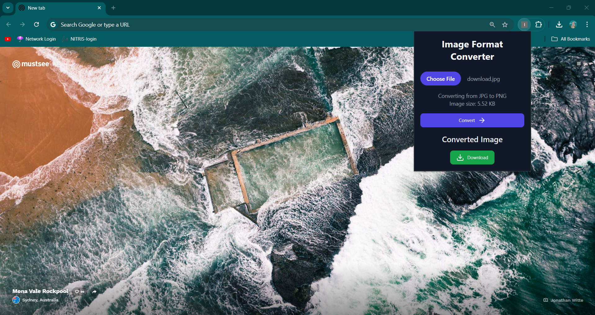

# Image Format Converter Chrome Extension

## Description

The Image Format Converter is a Chrome extension that allows users to quickly and easily convert images between JPG/JPEG and PNG formats directly within their browser. This tool is perfect for users who frequently need to change image formats without leaving their browsing environment.

## Features

- Convert JPG/JPEG images to PNG
- Convert PNG images to JPG/JPEG
- Simple and intuitive user interface
- Displays image size before conversion
- Quick download of converted images

## Installation

1. Clone this repository or download the source code.
2. Open Google Chrome and navigate to `chrome://extensions/`.
3. Enable "Developer mode" in the top right corner.
4. Click "Load unpacked" and select the directory containing the extension files.

## Usage

1. Click on the extension icon in your Chrome toolbar to open the converter.
2. Click "Choose File" to select the image you want to convert.
3. The extension will display the current format and size of the image.
4. Click "Convert" to process the image.
5. Once conversion is complete, click "Download" to save the converted image.

## Technologies Used

- HTML/CSS
- JavaScript
- Chrome Extension APIs
- Canvas API for image processing

## Development

To set up the project for development:

1. Install dependencies: npm install
2. Run the development server: npm run dev
3. To build the extension: npm run build-extension
